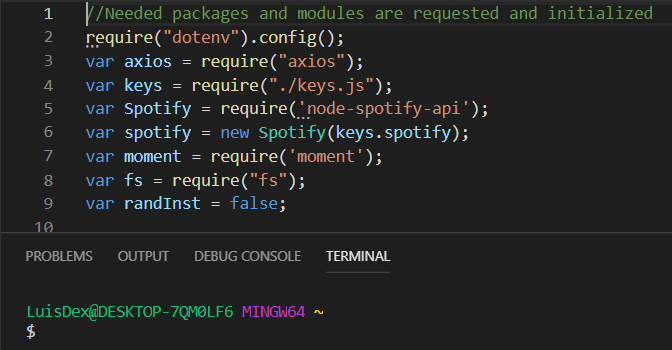
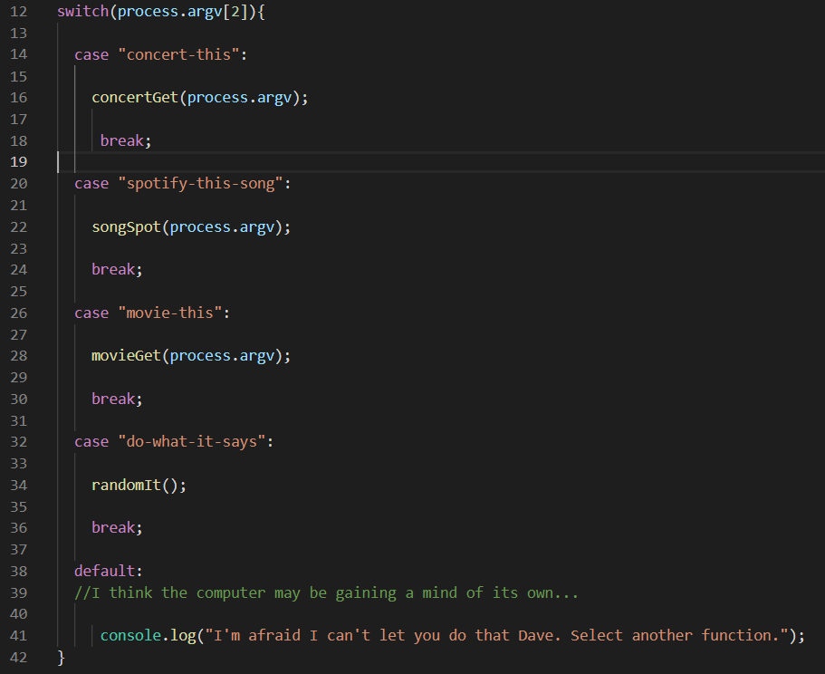
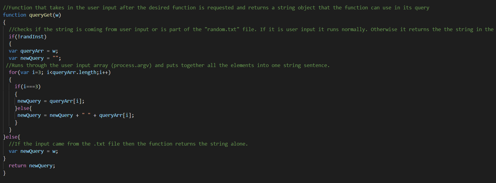
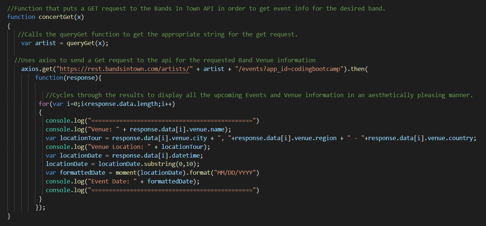
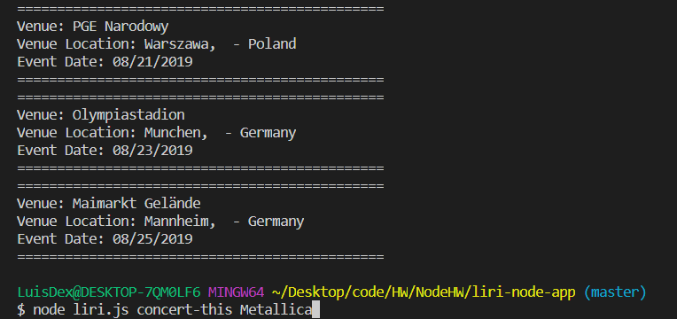
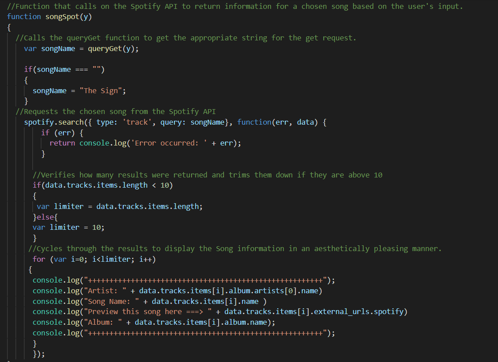
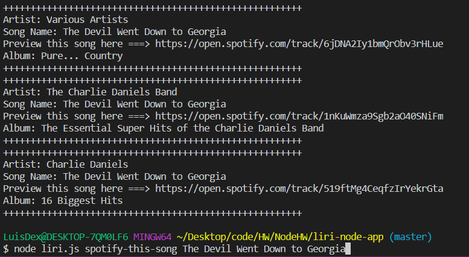
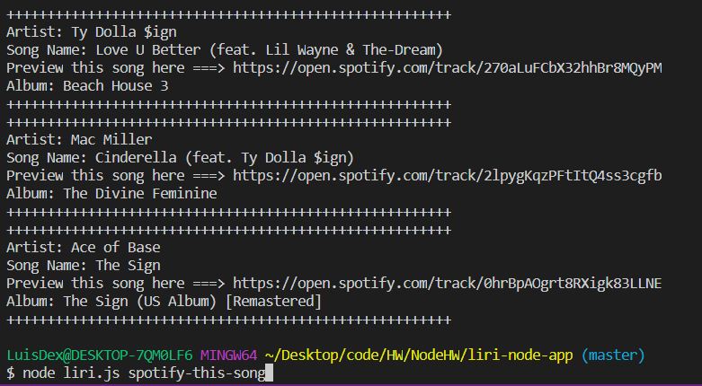
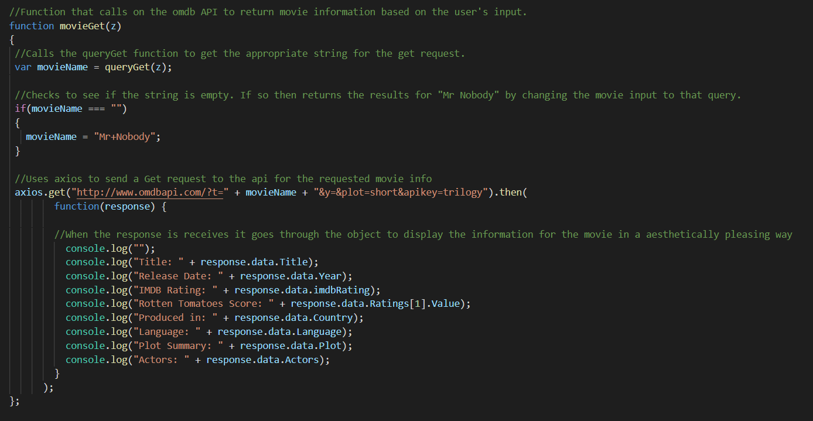
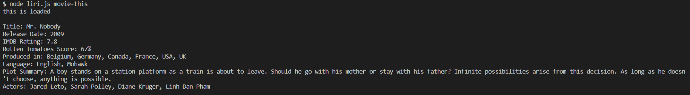

# Homework - "LIRI App"

### Overview of App Requirements

The main requirements for this assignment were to create a JS Node app that would take in several commands from the user and along with some additional user input, would return a series of information related to the user's request.

The user should be able to request the following from the app:

1. Concert information - The user can request concert venue information for an artist of their choosing by inputting the command: *concert-this* followed by the name of an artist or band.
1. Song information - The user can request information relating to a specific song, such as the Album name, by inputting the command: *spotify-this-song* followed by the name of the song they would like the app to display. 
1. Movie information - The user can request information relating to a movie, such as the IMDB Rating, by inputting the command: *movie-this* followed by the name of the movie they would like the app to display.
1. Instruction from Text - The user can input the command: *do-what-it-says* to instruct LIRI to draw their next instruction from a premade "random.txt" file. The app will take a string from this text and then run one of the previous 3 instructions. 

### Node Structure

##### Initialization and Switch System

The App code begins by initializing the multiple node modules that will be used throughout the rest of the code. In addition the variable called "randInst" is set to **false** and will be used later in the app when calling up the "Text Instruction" function.

Once all the nodules are initialized the user's input is passed through a switch method in order to call up the user's desired result. If the command made by the user (process.argv[2]) is not contained within the switch cases, then the node calls up its inner Hal 9000 and informs the user to try again.

### Functions Explained

##### queryGet function

Every function will call upon the queryGet function in order to generate the proper string with which to work. Initially the function will verify if the **randInst** variable is *true* or *false*. If it is *true*, this tells the function that the input came from a text file and hence it will just need to return it as is. If the value is *false* then the function will begin to call up every element of the *process.argv* array and then paste them together to form a string that any of the API's can use.

##### concertGet function

The concertGet function takes in an artist or band name in the form of a string, obtained by calling the queryGet function, and passes it through *axios* to the BandsInTown api in order to obtain upcoming tour dates and events for said band/artist. Upon getting a response from the api, the function cycles through the results to display each event with the following information: **Venue Name, Venue Location and the Date of the Venue**

After running the LIRI request the user will get a result similar to this:

##### songSpot function

The songSpot function takes in the name of a song or track in the form of a string, obtained by calling the queryGet function, and uses the *Spotify API module* to display the following information of the track to the user: **Artist Name, Song Name, A Link to Preview the Song and the name of the Album where the song can be found**. 

The function displays only the first 10 results if the query returns an array larger than 10. 

**Special Note:** if the user doesn't provide the name of a song, the function will automatically default to "The Sign" by Ace of Base.

##### movieGet function

The movieGet function takes in the name of a movie in the form of a string, obtained by calling the queryGet function, and uses the *OMDB API* to display the following information to the user: **Movie Title, Release Date, IMDB Rating, Rotten Tomatoes Score, Where the movie was produced, the main language of the film, a short Plot Summary and a list of actors from the movie**

The results will be displayed as such:

**Special Note:** if the user doesn't provide the name of a movie, the function will automatically default to "Mr. Nobody".

